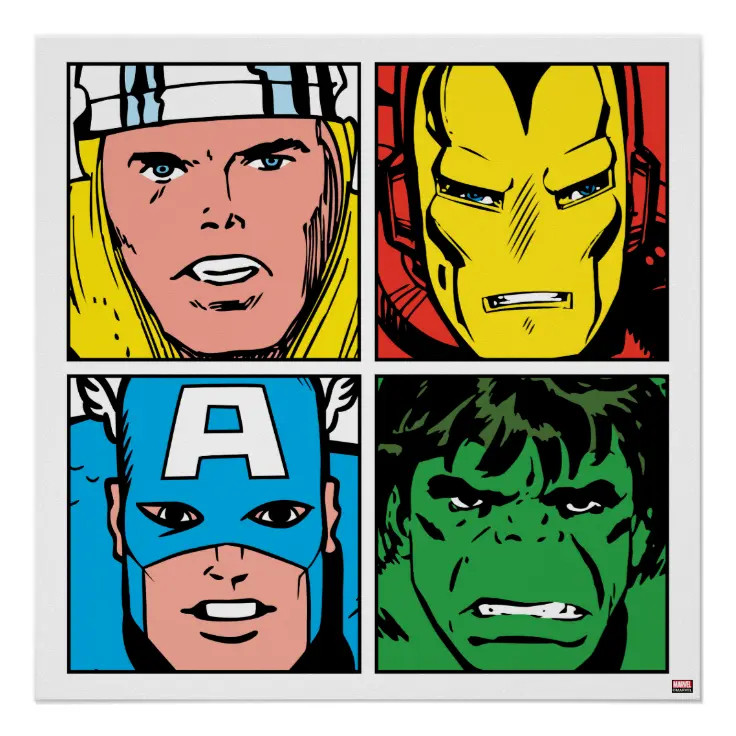
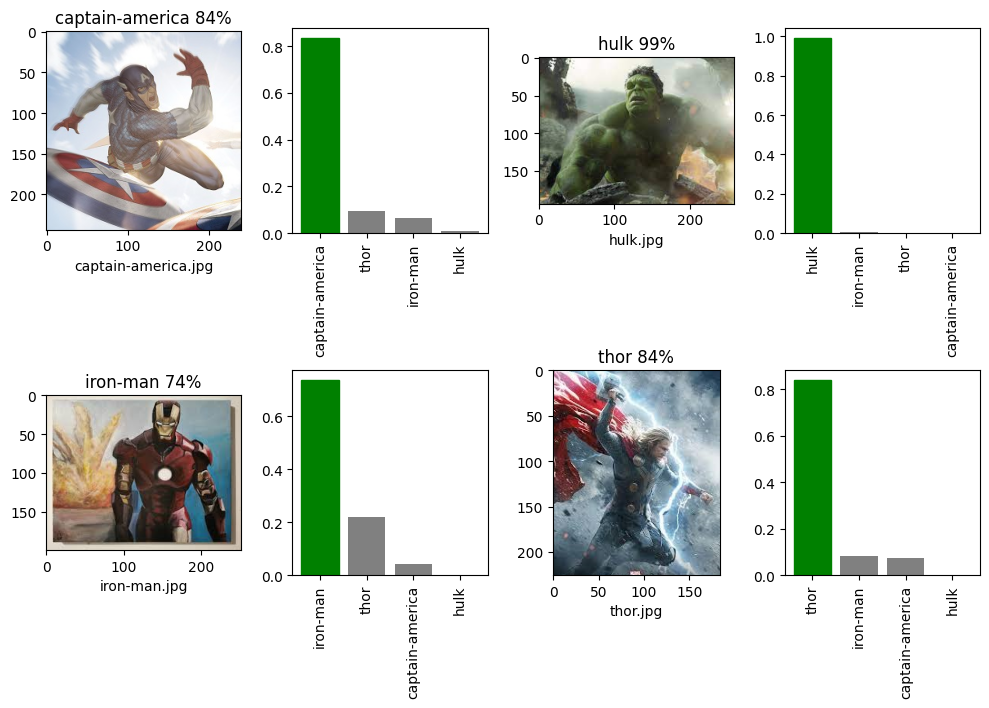

# ✪ Avengers Recognition with PyTorch and Keras Transfer Learning ✪

**Machine Learning Image Multiclass Classification**


 

 


## General info
This repository contains end-to-end multiclass image classifier using transfer learning with ResNet-50 in PyTorch and Keras (from TensorFlow) separately. It's about recognizing the Avengers - superheroes known from the Marvel universe. This project was inspired by the article [Keras vs. PyTorch: Alien vs. Predator recognition with transfer learning](https://deepsense.ai/keras-vs-pytorch-avp-transfer-learning/).

At the moment, the model has been trained to recognize 4 classes: Thor, Iron Man, Captain America and Hulk. It's possible that more characters will be added in the future.

<p align="center">

</p>


## Data
All images (403 for each class) were collected manually by author of this repository, using the Google image search engine and manual filtering. The data includes images of superheroes from various sources - movies, comics, cartoons, cosplays or toys. With this overfitting to a specific superhero image was avoided.

In order to avoid duplicate or very similar pictures, this [Duplicate Image Finder (difPy)](https://github.com/elisemercury/Duplicate-Image-Finder) was used to check the prepared dataset.

## Requirements
Technology versions used to create the model:
* Common
```
python==3.10.6
matplotlib==3.6.1
numpy==1.23.3
jupyterlab==3.4.4
IPython==8.4.0
```
* PyTorch
```
torch==1.13.0
torchvision==0.14.0
```
* TensorFlow, Keras
```
tensorflow==2.10.1
keras==2.10.0
```


## Setup
You need a program that supports the Jupyter notebook as well as having access to Python. If you use pip (the package installer for Python) you can install all necessary packages from within the project notebook. 

If you only want to take a look - just click on one of: 
* [`project_avengers-keras.ipynb`](https://github.com/mowczarz/ml-image-classification-avengers/blob/main/project_avengers-keras.ipynb) - using Keras,
* [`project_avengers-pytorch.ipynb`](https://github.com/mowczarz/ml-image-classification-avengers/blob/main/project_avengers-pytorch.ipynb)  - using PyTorch.

Have fun!

<p align="center">

</p>